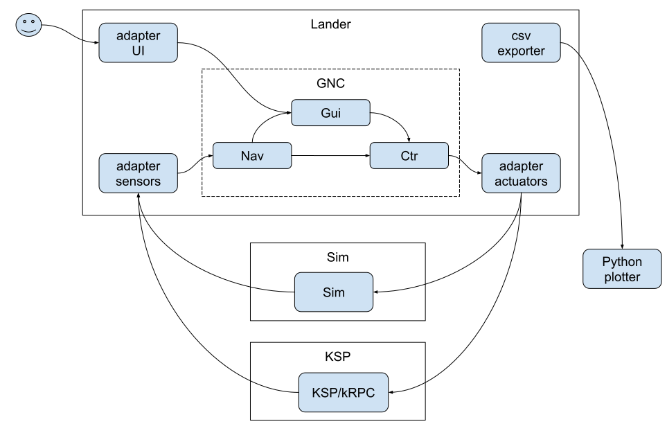
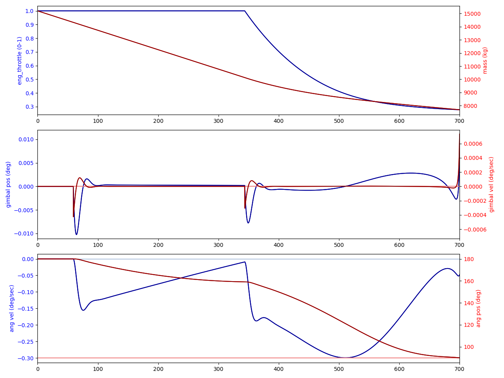
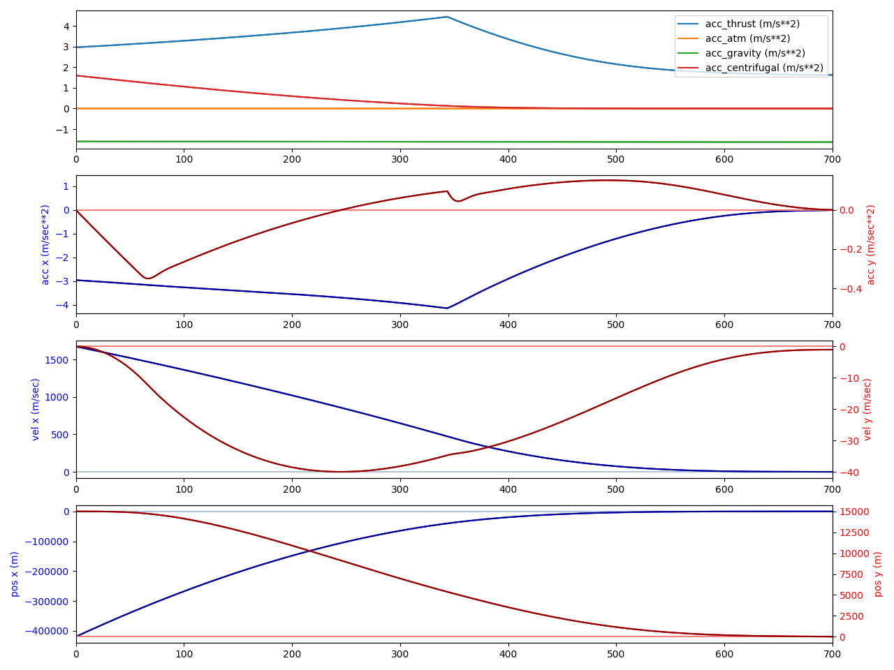

# README.md

*Note: work in progress. Refer to [TODO.md](TODO.md) for the roadmap.*

Moon\*1 lander\*2 guidance software.

The goal is to land on [KSP's Mun](https://wiki.kerbalspaceprogram.com/wiki/Mun).
This repo comes with a simulator to verify the guidance before attempting a landing.

* \*1: Moon, or any other body
* \*2: Land, or takeoff, or dv maneuver

## Architecture

**Overview**

1. The plan (From https://blog.nodraak.fr/2020/08/aerospace-sim-1-preliminary-study/): 
2. The first (Python) prototype: <https://blog.nodraak.fr/2020/12/aerospace-sim-2-guidance-law/>
3. The final (Rust) implementation: this repo

**Implementation**

GNC is implemented in Rust.

I/O will be implemented via adapters (to be able to swap between the simulator and KSP):

* Simulator: direct (Rust) function calls
* KSP: calling Python from Rust (https://github.com/PyO3/pyo3), itself calling kRPC lib (protobuf to KSP) (https://krpc.github.io/krpc/)

## Building and running

**Dependencies**

* Rust (and a few crates)
* For the `ksp` subcommand:
    * KSP game
    * kRPC addon: `sudo pip3 install krpc`

**Building**

`cargo build`

**Running**

Sim:

1. `cargo run -- -c conf/Apollo-descent.yaml sim`

KSP:

1. Start KSP and kRPC
2. `cargo run -- -c conf/Apollo-descent.yaml ksp`

Available scenarios:

* Apollo descent
* Apollo ascent
* Test Mission 1: 150 m hop
    * Ascent (takeoff)
    * Descent (landing)

**Plotting**

You can pipe moon_lander's stdout to plotter.py: `cargo run -- -c conf/Apollo-descent.yaml sim | py plotter.py`.
It will run MoonLander, then show some curves.
The graphs will also be saved as `output.png`.

Example landing (Apollo scenario):

## Key concepts needed for landing on the Moon

TODO: link blog article

* GNC -> [blog](https://blog.nodraak.fr/2020/08/aerospace-sim-1-preliminary-study/)
* TGO-based guidance (PID with a predesigned trajectory is flaky) -> [blog](https://blog.nodraak.fr/2020/12/aerospace-sim-2-guidance-law/)
* Take into account moon_gravity and moon_centrifugal (guidance)
* PD controller for the engine gimbal, using the spacecraft's angular position (P term) and velocity (D term) -> [blog](https://blog.nodraak.fr/2021/04/aerospace-sim-3-thrust-vector-control/)
* IMU and radar altimeter sensor fusion
